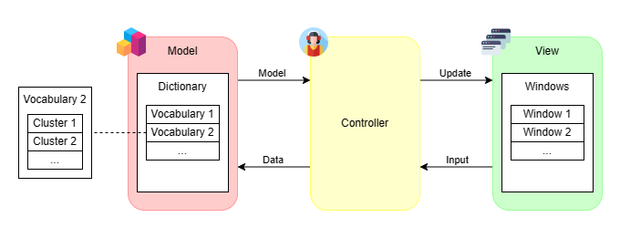

# Word-Sea
`Word-Sea` is a simple pure-Python application developed for vocabulary learning and revision.
It is particularly designed to assist students to learn and memorize new vocabularies.

<p align=center>
    
</p>

<p align=center>
    (Created using <a href="https://app.diagrams.net">draw.io</a>, with icons from <a href="https://www.flaticon.com">Flaticon</a>)
</p>


## Features
- Support real-time vocabulary look-up
- Save searched vocabularies and revise later
- Minimal design with custom themes


## Getting Started
You can clone this repository to your local computer via HTTPS.
```bash
git clone https://github.com/pystander/Word-Sea
```

### Prerequisites
You are recommended to use [pip](https://pypi.org/project/pip/) to install all required libraries in [requirements](requirements.txt) for this project.
```bash
pip install -r requirements.txt
```


## Usage
Run [app.py](app.py) to start the application window.
```bash
python app.py
```


## Support
You may report bugs and discuss any issue on [Issues](https://github.com/pystander/Word-Sea/issues).


## License
Distributed under the GNU GPL-3.0 License. See [LICENSE](LICENSE) for more information.
